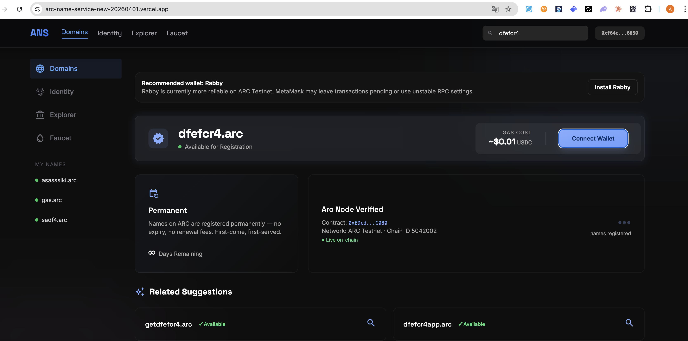
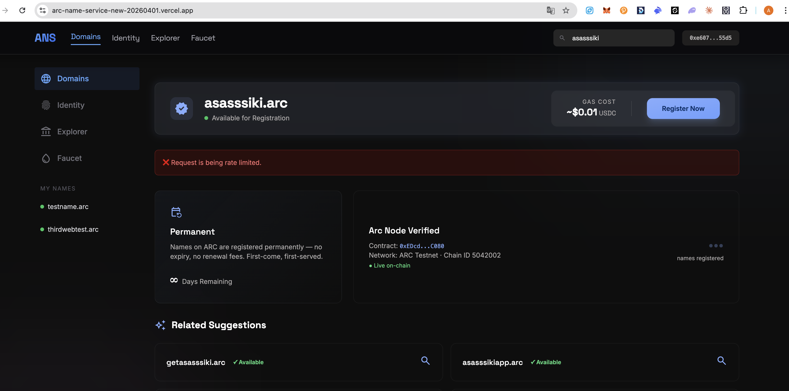
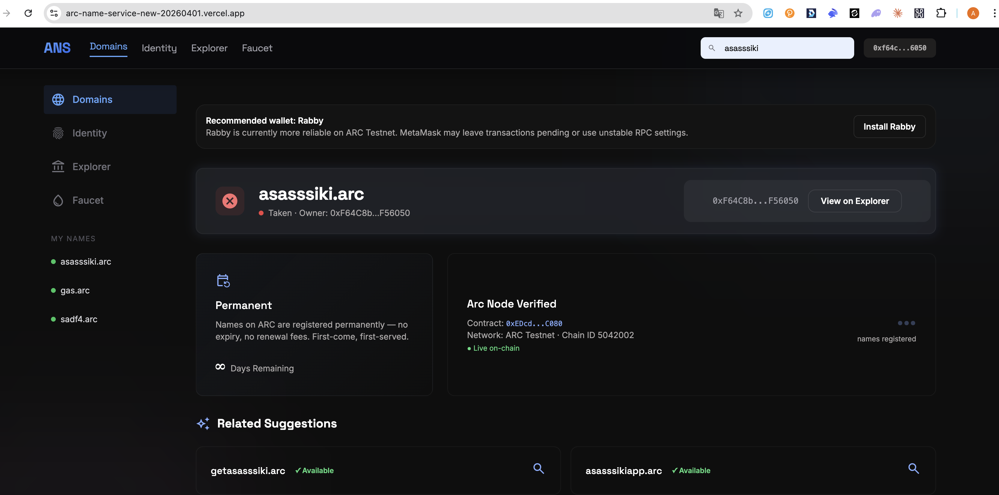

<div align="center">

# ARC Name Service

ENS-like naming and identity dApp for **ARC Testnet**

[](https://docs.arc.network)
[](https://docs.arc.network)
[](https://testnet.arcscan.app/address/0xEDcd3636584074cBCa4B685Cc5FE5080E70CC080)
[](https://arcnames.xyz)
[](https://vercel.com/docs/vercel-blob)

[Live App](https://arcnames.xyz) · [Docs](https://arcnames.xyz/docs) · [Explorer](https://testnet.arcscan.app/address/0xEDcd3636584074cBCa4B685Cc5FE5080E70CC080) · [Repository](https://github.com/Alicepoltora/arc-name-service)

</div>

ARC Name Service (`ANS`) is a lightweight ARC naming app that combines:

- on-chain `.arc` name registration
- wallet-based name ownership browsing
- a primary-name layer inside the app
- public domain profiles with avatar + Twitter/X
- public profile display directly in search results for taken domains

The project is intentionally simple in structure:

- one Solidity contract
- one single-file frontend
- a few small Vercel API routes

## Quick Start

### Use the live app

1. Open [arcnames.xyz](https://arcnames.xyz)
2. Connect a wallet
3. Switch to **ARC Testnet** if prompted
4. Get testnet USDC from [Circle Faucet](https://faucet.circle.com)
5. Search a name and register it
6. Open `Identity` to choose a primary name and customize its public profile

### Run locally

```bash
npm install
vercel env pull .env.local
vercel dev
```

### Deploy your own copy

```bash
vercel deploy --prod
```

## Screenshots

### Available domain search



### Taken / pending domain flow



### Search result state for taken domains



## Table Of Contents

- [Overview](#overview)
- [Features](#features)
- [Network And Contract](#network-and-contract)
- [How It Works](#how-it-works)
- [Architecture](#architecture)
- [Project Structure](#project-structure)
- [Local Development](#local-development)
- [Vercel Deployment](#vercel-deployment)
- [Contract Deployment](#contract-deployment)
- [Environment Variables](#environment-variables)
- [Limitations](#limitations)
- [Roadmap Ideas](#roadmap-ideas)

## Overview

`ANS` is an ENS-style registry built for **ARC Testnet**.

The app supports two main workflows:

### 1. Domains

The `Domains` section is the registration interface.

Users can:

- search `.arc` names
- check availability
- register available names through the live contract
- inspect recent registrations
- view suggestions for alternative names
- see extra public profile details if a domain is already taken

### 2. Identity

The `Identity` section is the profile layer for the connected wallet.

Users can:

- load all names owned by the connected wallet
- select one as the primary name inside the app
- upload a public avatar for that primary domain
- replace or remove the avatar
- connect a Twitter/X handle

Those profile details are then shown publicly when someone searches that taken domain.

## Features

### Naming

- Register `.arc` names on-chain
- Check whether a name is available
- Resolve the owner of a taken name
- List all names owned by the connected wallet
- Display recent registrations from the contract

### Identity Profiles

- Choose a primary app-level identity
- Upload public avatars through `Vercel Blob`
- Link a Twitter/X handle
- Show domain profile data in taken-domain search results

### Wallet UX

- ARC Testnet detection and switching
- wallet reconnect after page refresh
- active section persistence across reloads
- wallet-specific app state in `Domains` and `Identity`

### Backend Helpers

- ARC RPC failover proxy for reads
- wallet-signed profile updates
- public profile storage via Blob-backed JSON

## Network And Contract

| Item | Value |
|---|---|
| Network | ARC Testnet |
| Chain ID | `5042002` |
| Chain Hex | `0x4cef52` |
| Explorer | [testnet.arcscan.app](https://testnet.arcscan.app) |
| Contract | [`0xEDcd3636584074cBCa4B685Cc5FE5080E70CC080`](https://testnet.arcscan.app/address/0xEDcd3636584074cBCa4B685Cc5FE5080E70CC080) |
| Deploy TX | [`0xf776595fb3f79d765f11f7b8b6131ae3ab3574fbbdd350c7dd31ff1e03d4d6cf`](https://testnet.arcscan.app/tx/0xf776595fb3f79d765f11f7b8b6131ae3ab3574fbbdd350c7dd31ff1e03d4d6cf) |

Additional deployment details are in [deployment.txt](./deployment.txt).

## How It Works

### Name registration

The contract in [NameRegistry.sol](./NameRegistry.sol) handles:

- `register(string name)`
- `resolve(string name)`
- `isAvailable(string name)`
- `getNames(address owner)`
- `reverseResolve(address addr)`
- `nameCount(address owner)`

Validation rules:

- `3` to `32` characters
- lowercase `a-z`
- digits `0-9`
- hyphen `-`
- first-come, first-served

### Identity and public profiles

Profile data is stored off-chain and publicly readable.

Current profile fields:

- `avatar`
- `avatarPathname`
- `twitter`
- `address`
- `name`
- `updatedAt`

### Authorization

Profile changes are signed by the wallet before the server accepts them.

The app signs a message that includes:

- wallet address
- target domain
- action type
- timestamp
- profile fields being updated

The server verifies the signature and only then:

- accepts an avatar upload
- saves a profile JSON
- updates or removes public social links

### Public search result enhancement

When a domain is taken, the search result can display:

- owner address
- avatar
- Twitter/X handle
- explorer link

This makes the search page act like a lightweight public profile lookup.

## Architecture

The project has three layers.

### Smart contract

File:

- [NameRegistry.sol](./NameRegistry.sol)

Responsibilities:

- name registration
- ownership resolution
- availability checks
- owner name listing
- basic reverse resolution

### Frontend

File:

- [arc-ens.html](./arc-ens.html)

Stack:

- HTML
- Tailwind via CDN
- vanilla JavaScript
- `ethers` v6

Responsibilities:

- wallet connection
- ARC network setup
- search flow
- transaction status UX
- `Identity` UI
- avatar upload flow
- public profile preview and save

### Serverless API

Directory:

- [api](./api)

Routes:

- [api/rpc.js](./api/rpc.js)
  ARC RPC proxy with retry and failover
- [api/_identity.js](./api/_identity.js)
  shared identity proof and normalization helpers
- [api/blob-upload.js](./api/blob-upload.js)
  secure client upload handler for Vercel Blob
- [api/profile.js](./api/profile.js)
  public profile read/write endpoint

### Storage

The app uses **Vercel Blob** for:

- avatar files
- public profile JSON documents

That gives the project:

- public, shareable avatar URLs
- simple deployment on the same Vercel project
- no extra database required for the current scope

## Project Structure

```text
arc-name-service/
├── api/
│   ├── _identity.js
│   ├── blob-upload.js
│   ├── profile.js
│   └── rpc.js
├── assets/
│   └── screenshots/
│       ├── domain-pending.png
│       ├── domain-taken.png
│       └── domains-available.png
├── NameRegistry.sol
├── arc-ens.html
├── deployment.txt
├── package.json
├── vercel.json
└── README.md
```

## Local Development

Because the app uses Vercel Functions and Blob storage, the best local workflow is **Vercel Dev**, not opening the HTML file directly.

### Requirements

- Node.js 18+
- npm
- Vercel CLI
- a linked Vercel project
- ARC-compatible wallet

### Install dependencies

```bash
npm install
```

### Pull environment variables

```bash
vercel env pull .env.local
```

### Start the app

```bash
vercel dev
```

### Open locally

Open the local URL printed by Vercel CLI.

## Vercel Deployment

This repository is ready to deploy on Vercel.

### Required setup

- linked Vercel project
- public Blob store connected to that project
- `BLOB_READ_WRITE_TOKEN` available in the target environments

### Production deploy

```bash
vercel deploy --prod
```

### Root route behavior

[vercel.json](./vercel.json) rewrites:

- `/` -> `/arc-ens.html`

## Contract Deployment

To deploy a new registry contract:

```bash
forge create NameRegistry.sol:NameRegistry \
  --rpc-url https://rpc.testnet.arc.network \
  --private-key YOUR_PRIVATE_KEY \
  --broadcast
```

If you deploy a new contract, update:

- `CONTRACT_ADDRESS` in [arc-ens.html](./arc-ens.html)
- deployment references in [deployment.txt](./deployment.txt)

## Environment Variables

Main storage-related variable:

- `BLOB_READ_WRITE_TOKEN`

This token is typically injected by Vercel after the Blob store is linked to the project.

## Limitations

### Primary name

The app lets users choose a primary name inside the UI, but the contract does **not** yet support on-chain primary-name updates.

So today:

- app primary name = UI-level preference
- `reverseResolve(address)` = contract-level behavior

### Event design

`NameRegistered` uses `string indexed name`, which is less convenient for event decoding than a non-indexed string payload.

### MetaMask on ARC Testnet

Rabby currently tends to be more reliable than MetaMask on ARC Testnet in real usage.

### Public profile scope

The current profile schema is intentionally small:

- avatar
- Twitter/X

It does not yet include:

- bio
- banner image
- website links
- on-chain profile metadata

## Roadmap Ideas

- add a public profile route per domain
- add bio and banner support
- add true on-chain `setPrimaryName(...)` in a new contract version
- add richer profile discovery in search and identity views
- add profile caching and invalidation improvements

## Tech Stack

- Solidity `^0.8.20`
- ARC Testnet
- Vanilla HTML / JS
- Tailwind via CDN
- `ethers` `6.16.0`
- `@vercel/blob` `2.3.2`
- Vercel Functions
- Vercel Blob

## Status

This is an active ARC testnet project and should be considered an evolving dApp rather than a finished production identity protocol.
